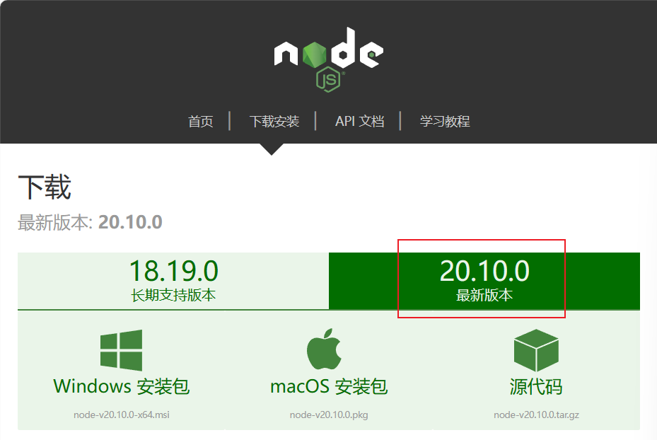
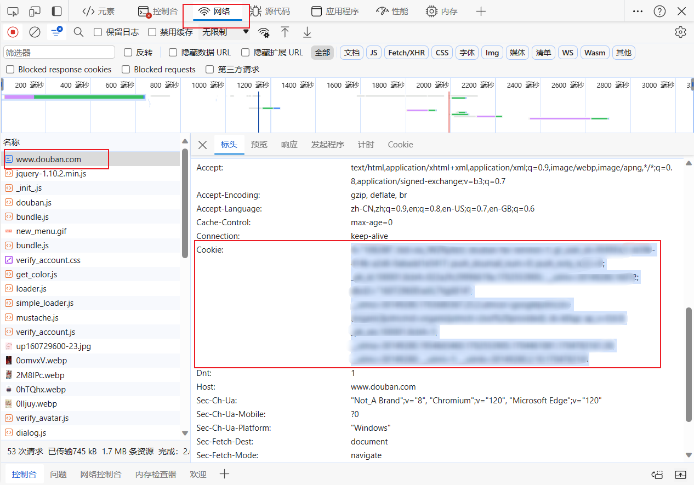

# 新手教程（无编程基础）

## 1. 安装 Node.js

这是运行本项目的基础软件。

下载网址：https://nodejs.cn/download/current/



下载好双击安装即可，没有特别的地方。

## 2. 安装 `douban-group-reporter`

首先需要配置一下国内镜像，因为软件都是发布到国外的网站，国内下载安装会比较慢。

快捷键 `🪟 + R` 输入 `cmd` 回车打开终端。如果是苹果电脑，快捷键 `Command + 空格键`，输入`终端`，点击打开即可。


在终端中输入如下命令回车：

```bash
npm config set registry https://registry.npmmirror.com
```

然后就可以安装举报工具了，在终端中输入如下命令回车：

```bash
npm i -g douban-group-reporter
```

## 3. 使用举报工具

首先我们需要拿到豆瓣网站的 Cookie。这里用微软 Edge 浏览器演示，电脑上打开豆瓣网，登录自己的账号，然后鼠标右键 → 检查 → 打开开发者工具 → 切换到`网络`标签页 → 点击浏览器左上角刷新豆瓣 → 点击`网络`标签页下第一个网址`www.douban.com`进入详情 → 向下滚动找到 Cookie 并全部复制出来备用。

> **注意：Cookie 是非常隐私的数据，不要泄露给第三个人！**



然后回到教程第二步里的终端（那个小黑窗），输入如下命令：

```bash
douban-app "刚才复制的 Cookie 粘贴到这里"
```

在终端里点击鼠标右键可以粘贴。Cookie 两边一定要加英文双引号，否则不生效。只有第一次需要输入 Cookie，后面只有 Cookie 失效了才需要再次输入，一般是好几个月或者你主动在电脑豆瓣上退出登录了，在使用举报工具的过程中会提醒你 Cookie 失效需要更换。

这时候会自动打开举报工具的网页应用：
1. 输入帖子网址，点击解析会看到帖子的评论
2. 超过一百条评论的帖子会展示翻页按钮
3. 在搜索框里输入用户名或者评论内容筛选评论，如果不筛选就是举报目前展示的全部评论
4. 最后选择举报理由，点击举报按钮即可，举报按钮会展示举报的进度
